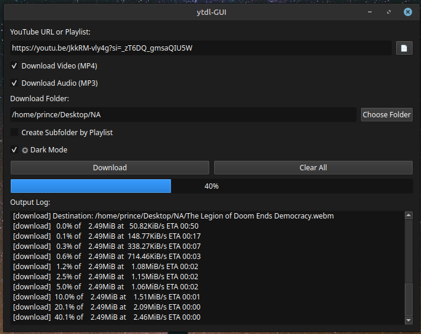
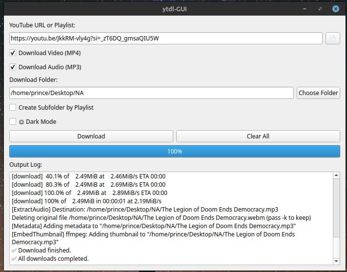
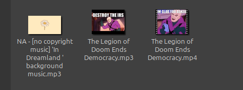

<p align="center">
  
</p>

<h1 align="center">DownTube</h1>

<p align="center">
  🎯 A simple personal YouTube video/audio downloader built with Python, PyQt5, and <a href="https://github.com/yt-dlp/yt-dlp">yt-dlp</a>.
</p>

<p align="center">
  🧪 Built and tested on Linux. Windows support is included — see instructions below!
</p>

---

## ✨ Features

- 🖼️ PyQt5-based modern GUI
- 🎥 Download YouTube videos (MP4) or extract audio (MP3)
- 🍪 Supports login-protected downloads using your `cookies.txt`
- 📁 Option to auto-organize playlist downloads into subfolders
- 🔧 Build into a single `.exe` or `.AppImage` using PyInstaller
- 🧪 Cross-platform (Linux & Windows supported)

---

## 🚀 Getting Started

### 🔧 Run via Python (Linux or Windows)

> Recommended if you're making changes or running in development mode.

1. **Clone this repository**
    ```bash
    git clone https://github.com/your-username/DownTube.git
    cd DownTube
    ```

2. **Create and activate a virtual environment**

    **Linux/macOS**
    ```bash
    python3 -m venv .venv
    source .venv/bin/activate
    ```

    **Windows**
    ```cmd
    python -m venv venv
    venv\Scripts\activate
    ```

3. **Install dependencies**
    ```bash
    pip install -r requirements.txt
    ```

4. **Run the app**
    ```bash
    python ytdl_gui.py
    ```

---

## 🛠️ Build a Standalone Executable (Optional)

Build a single-file executable with PyInstaller.

### 🐧 Linux
```bash
pyinstaller --onefile --noconsole --icon=icon.png \
  --add-data "yt-dlp:." \
  --add-data "cookies.txt:." \
  --add-data "icon.png:." \
  ytdl_gui.py
````

### 🪟 Windows (CMD or PowerShell)

```cmd
pyinstaller --onefile --noconsole --icon=icon.png ^
  --add-data "yt-dlp;." ^
  --add-data "cookies.txt;." ^
  --add-data "icon.png;." ^
  ytdl_gui.py
```

> The generated file will appear in the `dist/` folder.

---

## 🍪 Use Your Own Cookies

To download content that requires login (e.g., age-restricted or unlisted videos):

1. Install the [Get cookies.txt](https://chrome.google.com/webstore/detail/get-cookies-txt/) browser extension.
2. Log into YouTube in your browser.
3. Export the cookies to a file named `cookies.txt`.
4. Place it in the root folder (next to `ytdl_gui.py` or the executable).

---

## 📸 Screenshots

<p align="center">
  
  
</p>

---

## 🧪 Proof of Concept

<p align="center">
  
</p>

---

## 📦 Requirements

Install dependencies using:

```bash
pip install -r requirements.txt
```

Main packages:

* `PyQt5`
* `yt-dlp`
* `PyInstaller` (for building executables)

---

## 🤝 Contribute

This app is a personal project built for Linux, but it’s easy to adapt. Feel free to fork, improve, or open pull requests — especially for:

* 💻 Windows/macOS packaging
* 🌐 UI/UX improvements
* 🧪 Testing and automation

---

## ⚠️ Disclaimer

This project uses `yt-dlp` and respects its license. Use responsibly and comply with YouTube’s [terms of service](https://www.youtube.com/t/terms).

---

## 🧠 Why I Made This

I built DownTube to streamline my own workflow downloading videos — especially for restricted or playlist-based content. You're welcome to use it, improve it, or learn from it.

---

<p align="center">
  🧠 Made with passion. Happy downloading! 🎧📺
</p>

---

